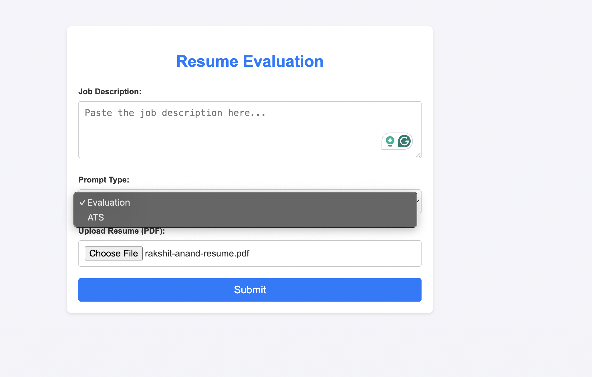

# Resume-screening
The Resume-Screening project leverages a Large Language Model (LLM) to automate the process of evaluating resumes against job descriptions. The system analyzes resumes in PDF format, extracts relevant content using OCR (Optical Character Recognition), and compares it with the job description provided by the user. 

